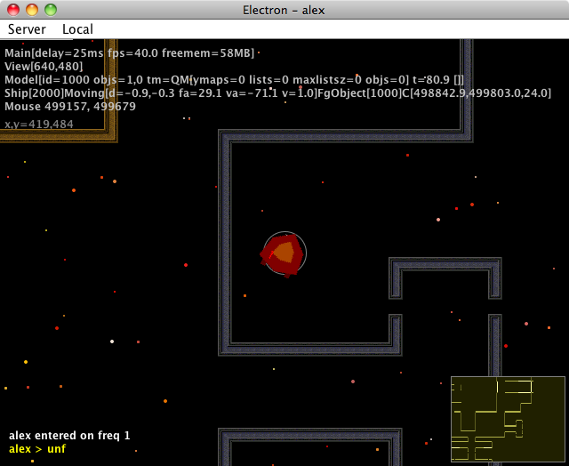
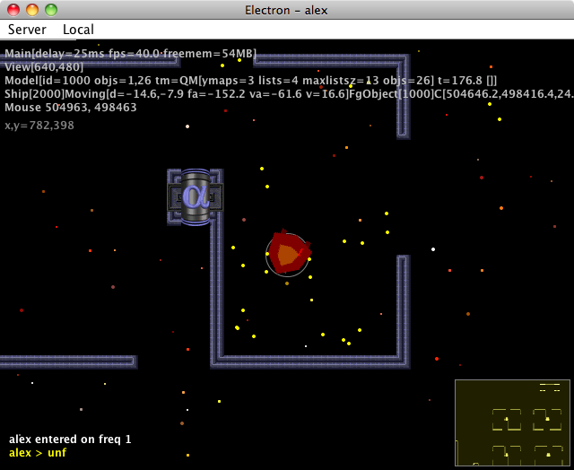
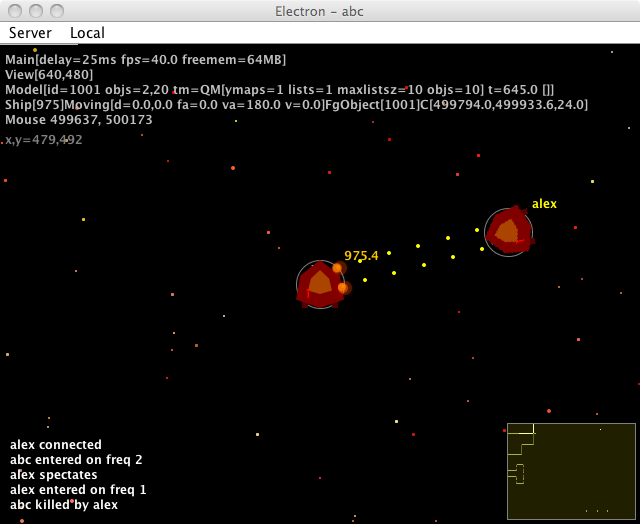

Electron
===========

A game based on Subspace, better known as Continuum:
http://en.wikipedia.org/wiki/SubSpace_(video_game)

Started around January 2011. Updated around July 2012.

Written in Java 1.6/1.7 using Swing/AWT/Java2D

Main classes are:
- el.ClientFrame - client
- el.serv.ServerMain - server
- el.bg.Lvl - lvl to png converter
  
Screenshots
-----------

Ship wandering around the Alpha West map

Two ships

Download
--------

[Runnable jar file](https://www.dropbox.com/s/qby3mf6wp6wluhk/el.jar?dl=0)
